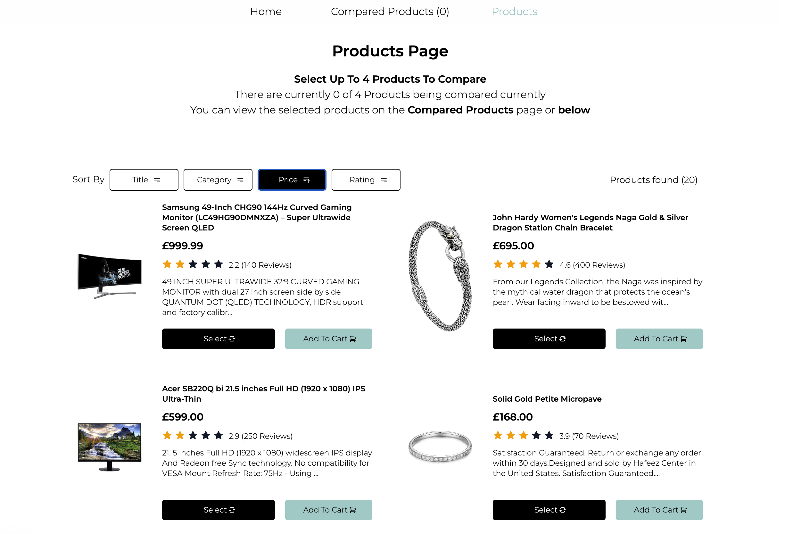

# Product Comparison Next.js App

This is a small single page product comparison application which utilises the best parts of Typescript, React, Redux Toolkit, Testing Library with Jest, Next.js and the fresh released TailwindCSS v4.0



I have made the most of the React and Next.js tools to best optimize the application. As well as utilizing other libraries such as the Redux Toolkit and its memoization capabilities which have great for more intensive selectors and function calls which are create for the sorting and processing of the products. I have also used the request caching capabilities of the Axios Cache Interceptor.

## Project Setup

This app was build using yarn and the the Create Next App with Redux Toolkit [Create Next App](https://github.com/vercel/next.js/tree/canary/packages/create-next-app/)

To get started here are steps to seting up this project.

### Install

```sh
yarn install
```

### To start testing in Development

```sh
yarn dev
```

### To create a build for Production

This will get bundled into the `./build` folder

```sh
pnpm build
```

Which can then be ran locally using the inclued package `serve`

```sh
yarn serve
```

### Run Unit Tests with [Jest](https://jestjs.io/)

To run one use the following to keep running use the `test-watch` version

```sh
yarn test
```

```sh
yarn test-watch
```

Library Links

[Redux Toolkit](https://redux-toolkit.js.org)

[Tailwind CSS](https://tailwindcss.com/)

[React Testing Library](https://testing-library.com/docs/react-testing-library/intro/)

[MSW](https://mswjs.io/)

[Axios Cache Interceptor](https://axios-cache-interceptor.js.org/)
[Next.js](https://nextjs.org/)
